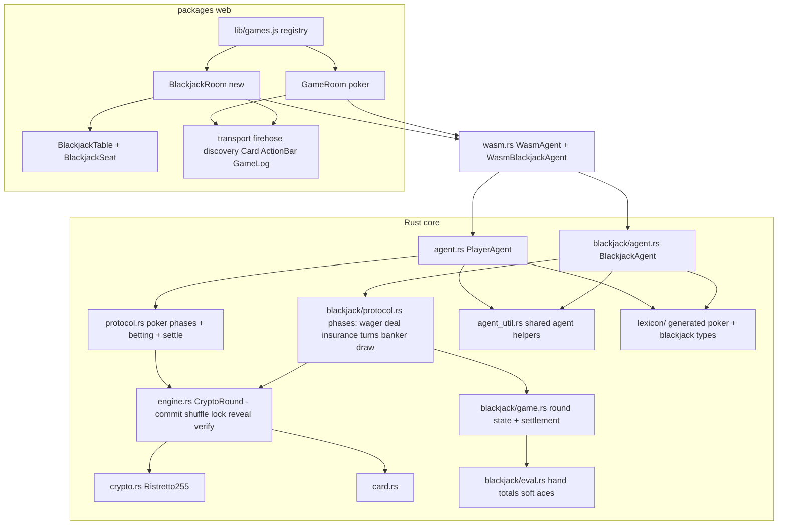

# Requirements

### Overview & Goals

Add **provably-fair multiplayer Blackjack** as a second game alongside Texas Hold'em, reusing the existing mental-card
cryptography (Ristretto255 commutative encryption, commit→shuffle→lock→reveal) and AT Protocol record transport. The
result is playable end-to-end in the browser exactly like poker is today: create a room, pick _Blackjack_, admit
players, play rounds until one player holds all chips, verify seeds afterwards.

Validated product decisions:

- **Scope**: full stack — Rust engine, new `re.cardco.blackjack.*` lexicons, WASM API, Svelte web UI.
- **Dealer model**: **rotating banker** — each round one player banks; others wager against the banker's stack; the
  banker's hand is auto-played by fixed rules; the role rotates like poker's button.
- **Dealing style**: **European no-hole-card (ENHC)** — every card is dealt face-up via an all-players reveal; the
  banker draws their remaining cards publicly after all players act. No hidden cards, no peek trust problem.
- **Moves**: hit, stand, **double down, split pairs, late surrender, insurance**.

### Scope

**In scope**

- Shared crypto-engine extraction from the poker protocol (single source of truth for the security-critical mechanics).
- Blackjack rules core, protocol state machine, `BlackjackAgent` (CBOR-in/CBOR-out), lexicons, WASM bindings.
- Web client: lobby game picker, NSID-driven routing, `BlackjackRoom`/`BlackjackTable`/`BlackjackSeat`, OAuth scope
  update.
- Tests at every layer (unit, fuzz, CBOR roundtrip, multi-agent relay, WASM browser, Playwright e2e) + README update.

**Out of scope**

- A blackjack terminal CLI (poker's `bin/poker.rs` stays poker-only).
- A blackjack `Simulator`/`simulate_game` WASM export (relay-style tests cover multi-agent flows).
- Multi-deck shoe (the crypto needs 52 unique card points; single deck, reshuffled every round).
- Changes to poker rules, poker lexicon NSIDs, or the deployed poker JS API (all changes are additive/back-compatible).
- `multiplayer-test.ts` (PDS smoke test stays poker-only).
- Timeout/abandonment handling (same posture as poker).

### Game Rules (exact variant)

- **Players**: 2–6 in seat order. Each round one seat is the **banker** (starts at seat 0, rotates to the next live seat
  each round). All others are **bettors**.
- **Wagering**: in seat order (left of banker), each bettor posts a wager: `min(minBet, chips) ≤ amount ≤ chips` (short
  stacks may wager all-in below `minBet`). Wagers are escrowed from chips immediately; doubles/splits/insurance deduct
  additionally when taken.
- **Initial deal** (all face-up): one card to each bettor in seat order, one **upcard** to the banker, then a second
  card to each bettor. The banker gets no second card (ENHC).
- **Insurance**: only if the banker upcard is an Ace. Each bettor in seat order takes or declines. Cost =
  `floor(wager/2)` (unavailable if 0 or unaffordable). Pays 2:1 if the banker ends with a 2-card 21; otherwise lost.
  Bettors holding blackjack may also insure (equivalent to even money).
- **Player turns** (seat order; split hand 0 then hand 1): options per hand —
    - **Hit** — draw one card; bust at >21 ends the hand.
    - **Stand** — end the hand. A total of 21 auto-stands; a natural blackjack (2-card 21, unsplit) auto-stands.
    - **Double down** — first two cards only, requires `chips ≥ hand wager`; wager doubles, exactly one card,
      auto-stand. Not allowed after split.
    - **Split** — first decision only, equal **rank** pair, requires `chips ≥ wager`; one split max (no resplit); each
      hand gets one card then plays in order. **Split aces** receive one card each and auto-stand. A 21 after splitting
      counts as 21, not blackjack.
    - **Surrender** (late) — first decision only, unsplit hand: forfeit `ceil(wager/2)` to the banker, keep the rest,
      hand leaves the round immediately (resolved before any banker blackjack).
- **Banker play**: after all player hands resolve, the banker draws face-up until total ≥ 17, standing on soft 17 (S17).
  The banker always completes their hand (uniform protocol, also resolves insurance). A 2-card 21 is a **banker
  blackjack**: all non-blackjack hands lose their full committed amount including doubles/splits (standard ENHC); a
  bettor blackjack pushes.
- **Settlement** (deterministic pure function): banker first **collects** all losing wagers and lost insurance, then *
  *pays** in seat order (insurance first, then hands in seat/hand order), each payment capped by the banker's remaining
  chips (the banker can go bankrupt mid-payout). Payouts: win 1:1; blackjack `floor(1.5 × wager)`; push returns wager;
  insurance win returns `3 × cost`.
- **Deck exhaustion** (defensive, near-impossible): if position 52 is reached when a card is needed, the affected hand
  auto-stands and the banker stands on their current total.
- **Eliminations & game over**: chips = 0 after settlement → eliminated (sits out, excluded from crypto like poker).
  Game over when at most one player has chips.
- **Verification**: identical to poker — seeds committed before the round, `verifySeed` after `Complete` enables full
  replay.

### User Stories

- As a host, I want to pick _Blackjack_ when creating a room so that my friends and I can play it over AT Protocol like
  poker.
- As a bettor, I want to wager and then hit/stand/double/split/surrender/insure with only legal options shown, so I
  can't make invalid moves.
- As the banker, I want my hand auto-played by fixed public rules so nobody (including me) can cheat.
- As any player, I want every card dealt via the cryptographic protocol and seeds verifiable afterwards, so the game is
  provably fair.
- As a spectator, I want to watch a blackjack table read-only via its `at://` URI.

### Functional Requirements

1. Lobby offers Poker and Blackjack; blackjack tables are created as `re.cardco.blackjack.table` with `players`,
   `startingChips`, `minBet` (defaults 1000 / 10); the room-lobby join/approve/start consensus flow works unchanged.
2. Deep links `/at://<did>/re.cardco.blackjack.table/<tid>` route to the blackjack room; poker links keep working.
3. All game actions are `re.cardco.blackjack.action` records keyed `{table-tid}-{seq}` with the same envelope (`table`
   strongRef, `prev`, `seq`, `createdAt`) and a `$type`-tagged union.
4. The UI shows: banker seat + banker cards with running total, each bettor's wager, hand(s) with totals, status
   badges (BLACKJACK / BUST / STAND / SURRENDER / INSURED), turn indicator, action bar with legal moves, wager input
   with min/max + quick amounts, round-result log, auto-advance to the next round.
5. Reload mid-round resumes as a player (replay own records by `(self, seq)` dedupe); non-seated visitors spectate.
6. Poker remains fully functional: all existing Rust, WASM-browser, and Playwright tests pass.

### Non-Functional Requirements

- No breaking changes to published poker records, poker lexicon NSIDs, or the existing `WasmAgent` JS API.
- Record sizes stay within the same bounds as poker (largest payloads are the same 52-point decks).
- OAuth client metadata gains `repo:re.cardco.blackjack.table` and `repo:re.cardco.blackjack.action` scopes (prod
  metadata redeploy needed).

# Technical Design

### Current Implementation

- `src/crypto.rs` — game-agnostic Ristretto255 commutative encryption (`PlayerKeys`, `PlayerRng`, N-position lock keys).
  `src/card.rs` — 52-card model, agnostic.
- `src/protocol.rs` (1182 ln) — `Phase`/`Action`/`ValidAction` + `ProtocolState::apply()`. ~Half is game-agnostic
  mechanics: commit-seed bookkeeping, turn-based shuffle/lock over `live_seats()`, reveal-scalar accounting with
  recipient exclusion, sequential `next_deck_position` cursor, seed verification. The rest is poker (streets 3/1/1,
  blinds, side pots, `eval::best_hand`).
- `src/game.rs` — Hold'em betting; `src/agent.rs` — `PlayerAgent` CBOR loop with `auto_respond_collect()` auto-playing
  all crypto actions and pausing on `NeedBet`; `src/wasm.rs` — thin `WasmAgent`; `src/lexicon/` — Jacquard-generated
  types from `lexicons/re/cardco/poker/*.json` (`just lexgen`).
- `packages/web` — game rules live entirely in Rust; NSIDs centralized in `atproto-publisher.js` (`LEXICONS`,
  `ACTION_TYPES`); `GameRoom.svelte` (745 ln) wires `PlayerSession` + `Publisher` + `FirehoseSubscriber`; `App.svelte`
  routes by flat page state from `at://` deep links; `Card`/`PlayerSeat`/`ActionBar`/`GameLog` are largely game-neutral.

### Key Decisions

| Decision               | Choice & rationale                                                                                                                                                                                                                                  |
|------------------------|-----------------------------------------------------------------------------------------------------------------------------------------------------------------------------------------------------------------------------------------------------|
| Engine organization    | **Shared crypto core** (user-validated): extract mechanics into `src/engine.rs::CryptoRound`; poker and blackjack state machines both use it. Single source of truth for security-critical code; mechanical refactor covered by the existing suite. |
| Banker dealing         | **ENHC** (user-validated): no face-down cards in blackjack at all — every deal is an N-of-N reveal; no `RevealHand`/showdown machinery needed.                                                                                                      |
| Web structure          | **Registry + sibling room** (user-validated): per-game config keyed by collection NSID; new `BlackjackRoom`/`BlackjackTable`/`BlackjackSeat`; poker screens untouched.                                                                              |
| Lexicons               | Parallel `re.cardco.blackjack.{table,action,defs}` mirroring poker (incl. copies of the crypto defs under the new namespace). Poker NSIDs are immutable (records in the wild); a shared-defs migration would only churn poker.                      |
| Wagering & decisions   | Turn-based in seat order via `action_on` (matches the deterministic single-writer-per-step protocol style; records are seq-chained anyway). Explicit `insurance: take/decline` action keeps the machine deterministic.                              |
| Cards stored decrypted | Blackjack cards are public → protocol maps revealed `Point`s to `Card`s immediately (via a `Point→Card` map as `sim.rs` already does); game state holds plain `Card`s.                                                                              |
| Banker solvency        | No wager caps; settlement is **collect-then-pay** in deterministic order with payouts capped by the banker's remaining chips.                                                                                                                       |
| Integer chips          | `floor` for 3:2 blackjack and insurance cost; surrender forfeits `ceil(wager/2)` (odd chip favors banker, mirroring poker's odd-chip precedent).                                                                                                    |
| Agents                 | Separate `BlackjackAgent` + `WasmBlackjackAgent` (no generics over `PlayerAgent`); shared helpers move to `src/agent_util.rs`. Keeps the poker API byte-stable.                                                                                     |

### Architecture Diagram



### Proposed Changes

**1. Engine extraction (`src/engine.rs`, new)** — move from `protocol.rs`, behavior-preserving:

```rust
pub struct CryptoRound {
    pub deck: Vec<Point>,
    pub seed_commitments: Vec<Option<[u8; HASH_BYTES]>>,
    pub shuffles_done: usize, pub locks_done: usize,
    pub deal_reveals: HashMap<PlayerId, Scalar>,
    pub next_deck_position: usize,
    pub seeds_verified: Vec<bool>,
}
impl CryptoRound {
    pub fn new(n: usize) -> Self;  pub fn reset_for_next_hand(&mut self);
    pub fn apply_commit_seed(&mut self, pid, commitment, live: &[usize]) -> Result<bool>; // true = all live committed; caller seeds deck via card_points()
    pub fn apply_shuffle(&mut self, pid, expected, deck: &[Point], live: &[usize]) -> Result<Option<PlayerId>>; // Some(next) or None = done
    pub fn apply_lock(...)   -> Result<Option<PlayerId>>; // same shape
    pub fn begin_deal(&mut self) -> usize;               // clears reveals, returns cursor
    pub fn apply_reveal(&mut self, pid, pos, expected_pos, scalar, exclude: Option<PlayerId>, eliminated: &[bool], live_count) -> Result<Option<Point>>; // Some(point) when complete
    pub fn apply_verify_seed(&mut self, pid, seed: &[u8]) -> Result<()>;
}
```

Poker's `ProtocolState` embeds `pub crypto: CryptoRound` (fields relocate; `Phase`/`Action`/`ValidAction` enums and
`apply()`/`valid_actions()` signatures unchanged). Call sites in `protocol.rs` tests, `sim.rs`, `agent.rs`,
`bin/poker.rs` updated mechanically.

**2. Blackjack rules core (`src/blackjack/eval.rs`, `src/blackjack/game.rs`, new)** — pure logic, no crypto:

```rust
// eval.rs
pub struct HandValue {
    pub total: u8,
    pub soft: bool
}
pub fn hand_value(cards: &[Card]) -> HandValue;   // A = 11/1
pub fn is_blackjack(cards: &[Card]) -> bool;      // exactly 2 cards, 21
// game.rs
pub enum Decision { Hit, Stand, Double, Split, Surrender }
pub struct Hand {
    pub cards: Vec<Card>,
    pub wager: u64,
    pub doubled: bool,
    pub stood: bool,
    pub busted: bool,
    pub split_aces: bool
}
pub struct BjPlayer {
    pub chips: u64,
    pub eliminated: bool,
    pub wager: u64,
    pub insurance: u64,
    pub hands: Vec<Hand>,
    pub surrendered: bool
}
pub struct BlackjackGame {
    pub players: Vec<BjPlayer>,
    pub banker: usize,
    pub banker_cards: Vec<Card>,
    pub min_bet: u64,
    pub action_on: Option<PlayerId>,
    ...
}
impl BlackjackGame {
    pub fn legal_decisions(&self, pid, hand: usize) -> Vec<Decision>;
    pub fn apply_wager / apply_insurance / apply_decision(...);
    pub fn banker_must_draw(&self) -> bool;        // S17
    pub fn settle(&mut self) -> RoundResult;       // collect-then-pay, capped
}
pub struct RoundResult {
    /* serde: banker {cards,total,blackjack,bust}, per-player hands
       {cards,total,wager,outcome,payout}, insurance, surrendered, chips_after */
}
```

**3. Blackjack protocol (`src/blackjack/protocol.rs`, new)** — mirrors poker's shape on top of `CryptoRound`:

```rust
pub enum BjPhase {
    Init,
    CommitSeeds,
    Shuffle { next_player },
    Lock { next_player },
    Wagering { action_on },
    Dealing { target: DealTarget, deck_position: usize },
    Insurance { action_on },
    PlayerTurn { action_on, hand: usize },
    BankerDraw,
    Complete
}
pub enum DealTarget { PlayerHand { player: PlayerId, hand: usize }, Banker }
pub enum BjAction {
    Table { players, starting_chips, min_bet },
    CommitSeed { .. },
    ShuffleDeck { .. },
    LockDeck { .. },
    RevealLockKey { .. },
    Wager { player_id, amount: u64 },
    Insurance { player_id, take: bool },
    Decision { player_id, decision: Decision },
    VerifySeed { .. }
}
pub enum BjValidActionKind {
    CommitSeed,
    ShuffleDeck,
    LockDeck,
    RevealLockKey { deck_position },
    Wager { min: u64, max: u64 },
    Insurance,
    Decision { options: Vec<Decision> },
    VerifySeed
}
pub struct BjProtocolState {
    pub phase: BjPhase,
    pub game: BlackjackGame,
    pub crypto: CryptoRound,
    card_map: HashMap<Point, Card>,
    pub hand_index: u64,
    pub last_round_result: Option<RoundResult>,
    ...
}
```

Flow: lock complete → `Wagering` → initial-deal queue (bettor 1st cards, banker upcard, bettor 2nd cards; every deal
`exclude=None`) → `Insurance` (only on Ace upcard) → `PlayerTurn` per seat/hand (hit/double/split each schedule a
`Dealing` then return) → `BankerDraw` (auto-schedules deals until ≥17 S17) → `settle()` → `Complete` → `VerifySeed`.
`start_next_round()` rotates banker to next live seat, bumps `hand_index`, applies eliminations; `game_over()` = at most
one player with chips. Deck-exhaustion guard auto-stands.

**4. Lexicons (`lexicons/re/cardco/blackjack/`, new)** — `table.json` (players 2–6, `startingChips`, `minBet`,
`createdAt`, optional `startedAt`/`updatedAt`); `action.json` (same envelope, union of
`re.cardco.blackjack.defs#commitSeed|shuffleDeck|lockDeck|revealLockKey|wager|insurance|decision|verifySeed`);
`defs.json` (crypto defs mirrored under the new namespace + `wager {amount}`, `insurance {take: boolean}`,
`decision {move: knownValues [hit, stand, double, split, surrender]}`). Regenerate via `cargo install jacquard-lexgen` +
`just lexgen`; fix any fallout from regenerated poker types (current generated code is stale vs `table.json`'s optional
`startedAt`/`updatedAt` — additive). Fallback if codegen is unavailable: hand-write the new modules in the exact
generated style of `src/lexicon/re_cardco/poker/*.rs`.

**5. Agent (`src/blackjack/agent.rs`, new; `src/agent_util.rs`, new)** — `BlackjackAgent` mirrors `PlayerAgent`:
`new(did, seed)`, `receive_table`, `receive_action`, `wager(amount)`, `insurance(take)`, `decide(Decision)`,
`next_round`, accessors (`my_hands`, `banker_cards`, `game_state_json`, `last_round_result_json`, `phase`, `game_over`)
and a `BjAgentOutput { Actions(Vec<Vec<u8>>), NeedWager{min,max}, NeedInsurance, NeedDecision{options}, Waiting }`.
Shared helpers move to `agent_util.rs`: `per_hand_seed`, `find_player_for_action`, and pure crypto-response builders (
commitment, shuffle deck+permutation, lock deck with `"lock:"+blake2b(deck_json)` context, 52 lock keys). Blackjack
`$type` dispatch mirrors `decode_action_cbor`.

**6. WASM (`src/wasm.rs`, modified — additive)**

```text
WasmBlackjackAgent: new(did, seed), receive_table(cbor), receive_action(cbor),
  act(s)  // "wager:50" | "insurance:yes|no" | "hit" | "stand" | "double" | "split" | "surrender"
  check_status(), next_round(), my_hands(), banker_cards(), phase(), game_state(),
  last_round_result(), game_over()
WasmBjOutput { kind: "actions"|"need_wager"|"need_insurance"|"need_decision"|"waiting",
               action_count, action(i), options /* JSON: {min,max} or [moves] */ }
```

**7. Web client (`packages/web`)** — new `src/lib/games.js` registry (
`{ id, label, tableCollection, actionCollection, actionTypes, defaults, roomComponent }` for poker + blackjack,
`gameForCollection(nsid)`); `App.svelte` parses the collection from the deep link and mounts the registered room;
`Lobby.svelte` gets a two-option game picker; `RoomLobby.svelte` parameterized (stakes label `min bet` vs `small blind`,
collection); `transport.js`/`firehose.js`/`discovery.js` take collection/prefix options defaulting to poker;
`atproto-publisher.js` adds blackjack NSIDs + record builders; `cardcore-wasm.js` exports `createBlackjackAgent`; new
`lib/blackjack-session.js` (`BlackjackSession` with the same pending-buffer/`(self,seq)`-dedupe mechanics as
`PlayerSession`, exposing `act()`, `hands`, `bankerCards`, `needsAction`, `options`); new components
`BlackjackRoom.svelte` (session wiring + status mapping + wager panel with min/max/quick amounts + ActionBar for moves +
result log + auto next round), `BlackjackTable.svelte` (seat ring reusing the rotation pattern, center shows banker
cards + total + min bet), `BlackjackSeat.svelte` (face-up hand(s), totals, wager, badges; reuses `Card.svelte`);
`oauth-client-metadata.template.json` adds the blackjack repo scopes.

### File Structure

**New**: `src/engine.rs`, `src/agent_util.rs`, `src/blackjack/{mod,eval,game,protocol,agent}.rs`,
`lexicons/re/cardco/blackjack/{table,action,defs}.json`, `src/lexicon/re_cardco/blackjack.rs` +
`blackjack/{table,action,defs}.rs` (generated), `tests/blackjack_integration.rs`, `tests/blackjack_agent.rs`,
`packages/web/src/lib/{games.js,blackjack-session.js}`,
`packages/web/src/components/{BlackjackRoom,BlackjackTable,BlackjackSeat}.svelte`,
`packages/web/tests/blackjack.spec.ts`.
**Modified**: `src/lib.rs`, `src/protocol.rs`, `src/agent.rs`, `src/sim.rs`, `src/bin/poker.rs` (field-path updates
only), `src/wasm.rs`, `src/lexicon/{mod.rs,re_cardco.rs}` (regenerated), `tests/cbor.rs`, `tests/wasm_browser.rs`,
`packages/web/src/lib/{atproto-publisher,transport,firehose,discovery,cardcore-wasm}.js`,
`packages/web/src/{App.svelte}`, `packages/web/src/components/{Lobby,RoomLobby}.svelte`,
`packages/web/tests/helpers.ts`, `packages/web/oauth-client-metadata.template.json`, `README.md`.

### Risks

- **Engine-extraction regression** in security-critical code → behavior-preserving mechanical moves, validated by the
  full poker suite (unit + relay + fuzz + WASM browser + Playwright).
- **`jacquard-codegen` availability/version drift**; regeneration also refreshes stale poker types (additive optional
  fields) → install pinned 0.11.x, fix fallout; fallback to hand-written generated-style modules.
- **Banker insolvency & integer rounding disputes** → exact deterministic rules speced (collect-then-pay, floors/ceils)
  with dedicated unit tests.
- **Deck exhaustion** with 6 players + splits → deterministic auto-stand rule + test.
- **ENHC unfamiliarity** (banker blackjack takes doubles/splits) → documented in README and surfaced in the round-result
  log.
- **OAuth scope**: prod client metadata must be redeployed or real-PDS writes to blackjack collections fail; demo/dev
  mode unaffected.
- **UI duplication drift** between `GameRoom` and `BlackjackRoom` → accepted trade-off of the chosen sibling-room
  architecture; shared primitives imported from common modules.

# Testing

### Validation Approach

Mirror the poker test stack at every layer (real crypto, no mocks), plus a hard regression gate: after the engine
extraction and after each subsequent stage, the existing poker suites must pass unchanged — `cargo test --release`,
`wasm-pack test --headless --chrome --release`, and the poker Playwright specs (`pnpm --filter @cardcore/web test`).
Blackjack outcomes are card-dependent, so multi-agent and e2e tests assert structural invariants (phase progression,
chip conservation, legal-options correctness, result-log presence) rather than fixed outcomes, and unit tests pin exact
rules with constructed hands.

### Key Scenarios

- **Hand math** (`blackjack/eval.rs` units): soft/hard ace totals, blackjack detection (2-card 21 only), bust, soft-17
  detection for S17.
- **Rules legality** (`blackjack/game.rs` units): wager bounds incl. short-stack all-in below `minBet`; double only on
  first two cards with sufficient chips; split only on equal-rank first decision, no resplit, no double-after-split,
  split aces one-card auto-stand; surrender only as first unsplit decision; insurance only vs Ace upcard with
  `floor(wager/2) ≥ 1`.
- **Settlement matrix** (units): 1:1 win, `floor(1.5w)` blackjack, push, bust-loses-first, banker bust pays all
  standers, banker blackjack takes doubles/splits (ENHC) but pushes vs bettor blackjack, insurance 2:1, surrender
  forfeits `ceil(w/2)`, collect-then-pay order with banker bankruptcy mid-payout (capped partial payment), chip
  conservation across all players every round.
- **Protocol flow** (`blackjack/protocol.rs` units): lock → wagering order; initial-deal sequence (bettors, upcard,
  bettors); insurance phase skipped without Ace; hit/double/split scheduling deals and returning to the right hand;
  banker S17 auto-draw; banker rotation, elimination, `game_over`; `verify_seed` after `Complete`.
- **Agents** (`tests/blackjack_agent.rs`): 2- and 3-agent full round via the CBOR relay pattern from `tests/agent.rs`;
  multi-round game with banker rotation via `next_round()`; spectator agent replays the full round read-only.
- **CBOR** (`tests/cbor.rs`): roundtrips for `wager`, `insurance`, `decision`, and the mirrored crypto variants under
  `re.cardco.blackjack.defs#*`.
- **WASM** (`tests/wasm_browser.rs`): 2-agent blackjack round in headless Chrome via `WasmBlackjackAgent` (
  `act("wager:10")` → decisions → `Complete`, `last_round_result` non-empty).
- **Web e2e** (`packages/web/tests/blackjack.spec.ts`): two demo players — lobby picker → blackjack room via consensus
  flow; wager posted; action bar shows only legal moves; prefer-STAND loop until the round-result log appears; banker
  cards + totals rendered; chips update; auto-advance to next round with rotated banker; deep-link routing for both
  `re.cardco.poker.table` and `re.cardco.blackjack.table` URIs.

### Edge Cases

- Fuzz (`tests/blackjack_integration.rs`, pattern from `tests/integration.rs`): random valid + invalid actions against
  `BjProtocolState` — never panics, rejects out-of-turn wagers/decisions, wrong deck positions, double-reveals,
  eliminated-player actions.
- Deck exhaustion → forced auto-stand path (unit test with a crafted near-exhausted state).
- Odd-chip roundings: odd wager surrender, odd wager blackjack payout, wager of 1 (insurance unavailable).
- All bettors bust → banker still completes to ≥17 and settlement runs.
- Bettor blackjack + banker Ace upcard: insurance taken (even-money equivalent) and declined variants.
- Heads-up (1 banker + 1 bettor) and 6-player round; eliminated banker skipped in rotation.
- Seed verification failure (wrong seed vs commitment) rejected.

### Test Changes

- **Add**: `tests/blackjack_agent.rs`, `tests/blackjack_integration.rs`, unit modules in `src/blackjack/*.rs`, blackjack
  cases in `tests/cbor.rs` and `tests/wasm_browser.rs`, `packages/web/tests/blackjack.spec.ts`, parameterized
  `startOpenRoomGame(..., { game })` in `packages/web/tests/helpers.ts`.
- **Update mechanically**: field paths in `src/protocol.rs` unit tests touched by the `CryptoRound` extraction (e.g.,
  `seed_commitments` → `crypto.seed_commitments`).
- **Intentionally unchanged**: all poker assertions and flows — they serve as the regression gate.

# Delivery Steps

### ✓ Step 1: Extract shared crypto engine from the poker protocol

Poker runs unchanged on a new game-agnostic `engine::CryptoRound`, with the full existing test suite green.

- Create `src/engine.rs` with `CryptoRound` (deck, seed commitments, shuffle/lock counters, reveal accounting, deck
  cursor, seed verification) and methods `apply_commit_seed`, `apply_shuffle`, `apply_lock`, `begin_deal`,
  `apply_reveal`, `apply_verify_seed`, `reset_for_next_hand` — moved verbatim from `src/protocol.rs`.
- Refactor poker's `ProtocolState` to embed `pub crypto: CryptoRound`, keeping `Phase`/`Action`/`ValidAction` and the
  `apply()`/`valid_actions()` API unchanged.
- Create `src/agent_util.rs` with shared agent helpers (`per_hand_seed`, `find_player_for_action`, crypto-response
  builders for commitment/shuffle/lock/reveal) and point `src/agent.rs` at them.
- Update field paths mechanically in `src/protocol.rs` unit tests, `src/sim.rs`, and `src/bin/poker.rs`; register
  `engine` and `agent_util` in `src/lib.rs`.
- Verify with `cargo test --release` and `wasm-pack test --headless --chrome --release` (poker regression gate).

### ✓ Step 2: Implement blackjack rules core (hand math, round state, settlement)

A pure, crypto-free blackjack rules library with the full ENHC rotating-banker rule set, fully unit-tested.

- Add `src/blackjack/eval.rs`: `hand_value` (soft/hard aces), `is_blackjack`, bust and soft-17 helpers.
- Add `src/blackjack/game.rs`: `BlackjackGame`, `BjPlayer`, `Hand`, `Decision` enum; wager bounds (incl. short-stack
  all-in), turn order, `legal_decisions` (double/split/surrender/insurance gating per spec), split state tree (one split
  max, split-aces one card), banker S17 draw rule.
- Implement deterministic `settle() -> RoundResult`: collect-then-pay order, payouts (1:1, `floor(1.5w)` blackjack,
  push, insurance 2:1, surrender `ceil(w/2)`), banker-bankruptcy capping, ENHC banker-blackjack handling, eliminations.
- Unit tests: legality matrix, settlement matrix, integer roundings, chip conservation, banker rotation and `game_over`.

### ✓ Step 3: Build the blackjack protocol state machine on the shared engine

`BjProtocolState` drives a full provably-fair round end-to-end in native tests, including fuzzing.

- Add `src/blackjack/protocol.rs`: `BjPhase`, `BjAction`, `DealTarget`, `BjValidActionKind`, `BjProtocolState` embedding
  `CryptoRound` + `BlackjackGame` + a `Point→Card` map.
- Wire the flow: commit/shuffle/lock (shared engine) → `Wagering` → initial-deal queue (bettor cards, banker upcard, all
  face-up `exclude=None`) → conditional `Insurance` → `PlayerTurn` with deal scheduling for hit/double/split →
  `BankerDraw` to S17 → `settle()` → `Complete` → `VerifySeed`.
- Implement `valid_actions()`, `start_next_round()` (banker rotation, hand_index bump, eliminations), `game_over()`, and
  the deck-exhaustion auto-stand guard.
- Unit tests for phase transitions and dealing order; add `tests/blackjack_integration.rs` with a full-round protocol
  test plus valid/invalid-action fuzzing (pattern from `tests/integration.rs`).

### ✓ Step 4: Add blackjack lexicons, generated types, and the CBOR agent

`BlackjackAgent` plays complete rounds over DAG-CBOR `re.cardco.blackjack.*` records in multi-agent relay tests.

- Author `lexicons/re/cardco/blackjack/{table,action,defs}.json`: table (players 2–6, `startingChips`, `minBet`), action
  envelope with `$type` union, defs (mirrored crypto defs + `wager`, `insurance`, `decision`).
- Regenerate `src/lexicon/` via `cargo install jacquard-lexgen` + `just lexgen`; fix fallout from refreshed poker
  types (fallback: hand-write blackjack modules in the generated style).
- Add `src/blackjack/agent.rs`: `BlackjackAgent` with `receive_table`/`receive_action`/`wager`/`insurance`/`decide`/
  `next_round`, `BjAgentOutput`, blackjack `$type` dispatch, auto-respond loop reusing `agent_util` crypto builders, and
  JSON accessors (`my_hands`, `banker_cards`, `game_state_json`, `last_round_result_json`).
- Tests: blackjack union roundtrips in `tests/cbor.rs`; `tests/blackjack_agent.rs` with 2/3-agent relay rounds,
  multi-round banker rotation, and a spectator replay.

### ✓ Step 5: Expose blackjack through WASM bindings

`WasmBlackjackAgent` is callable from JS with the string-action protocol and passes a headless-Chrome browser test.

- Add `WasmBlackjackAgent` and `WasmBjOutput` to `src/wasm.rs` (additive; `WasmAgent` untouched): `act()` parsing
  `wager:N` / `insurance:yes|no` / `hit|stand|double|split|surrender`, `check_status`, `next_round`, JSON accessors,
  output kinds `actions|need_wager|need_insurance|need_decision|waiting` with an `options` payload.
- Extend `tests/wasm_browser.rs` with a 2-agent blackjack round driven through the WASM API to `Complete`.
- Rebuild `pkg/` via `just build-wasm` and confirm poker WASM tests still pass.

### ✓ Step 6: Wire game selection and blackjack plumbing into the web client

Users can create and join blackjack rooms from the lobby; records flow over the right collections; poker screens are
untouched.

- Add `packages/web/src/lib/games.js`: per-game registry (collections, action types, defaults
  `startingChips:1000, minBet:10`, labels, room component) + `gameForCollection()`.
- Parameterize `transport.js` (Publisher collections), `firehose.js` (action path prefix), `discovery.js` (table
  collection) with poker defaults; add blackjack NSIDs/builders to `atproto-publisher.js`; export `createBlackjackAgent`
  from `cardcore-wasm.js`.
- Add the game picker to `Lobby.svelte`; parameterize `RoomLobby.svelte` (stakes label, collection); route deep links by
  collection in `App.svelte` to the registered room component.
- Add blackjack repo scopes to `oauth-client-metadata.template.json`.
- Verify poker Playwright specs still pass and a blackjack room reaches the room-lobby stage.

### ✓ Step 7: Build the blackjack room UI and end-to-end tests

Two players can play complete blackjack rounds in the browser, covered by a Playwright spec, with documentation updated.

- Add `lib/blackjack-session.js` (`BlackjackSession`: pending-buffer + `(self,seq)` dedupe like `PlayerSession`,
  exposing `act()`, `hands`, `bankerCards`, `needsAction`, `options`).
- Add `BlackjackRoom.svelte` (session/publisher/firehose wiring, wager panel with min/max + quick amounts, ActionBar
  with legal moves incl. insurance, round-result logging, auto next-round, spectator + reload-resume) and
  `BlackjackTable.svelte` / `BlackjackSeat.svelte` (seat ring with banker badge, banker cards + running total, face-up
  hands with totals, wager and status badges; reuses `Card.svelte`, `GameLog.svelte`).
- Parameterize `tests/helpers.ts` (`startOpenRoomGame(..., { game })`) and add `tests/blackjack.spec.ts`: full round
  with prefer-STAND loop, structural assertions (legal buttons, result log, banker cards, chip updates, banker rotation
  on next round).
- Update `README.md` with the blackjack rules variant, collections, and WASM API snippet; run the full suite (
  `just test-all`) as the final gate.
